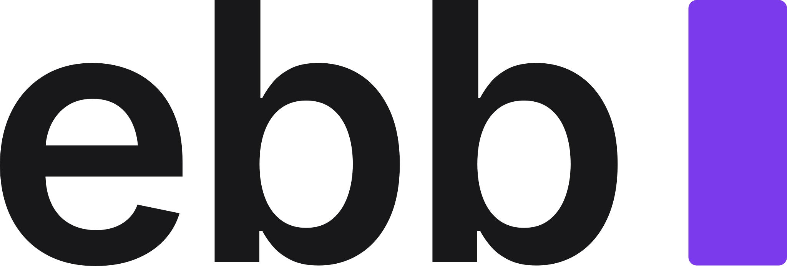

<div align="center">



# ebb

[](https://www.mozilla.org/MPL/2.0/)

</div>

**ebb** is a modern, keyboard-first editor for flowing competitive debate
rounds. Each flow is a `.ebb` file on your own machine - move it, copy it, back
it up, or open it by double-clicking, like any other document. New flows are
filed in `~/Documents/ebb` and saved as you type. ebb is open source under the
[Mozilla Public License 2.0](https://www.mozilla.org/MPL/2.0/).

## Installing

Desktop builds are found on the [releases page](https://github.com/shreerammodi/ebb/releases).

### MacOS

Requires macOS 11 (Big Sur) or later.

1. Download `ebb_<version>_universal.dmg`. One build covers both Apple Silicon
   and Intel Macs.

2. Open the `*.dmg` file, and drag ebb to your Applications folder.

On first launch, you will need to authorize the app to open since it's unsigned.

If you see:

> Can’t be opened because Apple cannot check it for malicious software

go to System Settings > Privacy & Security > scroll down > click "Open Anyway".

If instead you see:

> "ebb.app" is damaged and can't be opened. You should move it to the Trash

this is macOS Gatekeeper quarantining the download, not actual damage. Remove
the quarantine flag in Terminal, then open the app normally:

```bash
xattr -dr com.apple.quarantine /Applications/ebb.app
```

If you would like a standalone copy instead of an installer, download
`ebb_<version>_universal.app.tar.gz` and unarchive it. Unarchive it on the Mac
you will run it on: sending the unarchived `ebb.app` through a Windows machine,
a cloud-drive "download as zip", or a FAT-formatted drive breaks the app's code
signature, and macOS then refuses to launch it with no error message.

### Windows

1. Download `*-setup.exe`
2. Run the installer

On first launch, you'll see "Windows protected your PC." Click More info > Run anyway.

### Linux

1. Download the `*.AppImage` file.
2. Make it executable and run it:

```bash
chmod +x ebb_*.AppImage
./ebb_*.AppImage
```

## Building From Source

Requires [Node.js](https://nodejs.org/) and npm.

```bash
npm install
npm run dev        # start the local web app at http://localhost:3000
```

### Desktop app

The desktop build (via [Tauri](https://tauri.app/)) is the preferred way to run
ebb.

```bash
npm run desktop:dev      # run the desktop app against a live dev server
npm run desktop:build    # produce a native installer in src-tauri/target
```

#### Standalone binaries

`desktop:build` bundles every installer the host platform can make, which on
macOS means a `.dmg` you have to open before you can run anything. These build
the runnable artifact on its own instead, into `src-tauri/target/release`, and
skip the updater artifacts (no signing key needed):

```bash
npm run desktop:build:bin              # bare executable, any platform
npm run desktop:build:macos            # ebb.app for the host arch, no dmg
npm run desktop:build:macos-universal  # ebb.app for both Apple arches, no dmg
npm run desktop:build:linux            # single-file AppImage
```

On Windows, `desktop:build:bin` is the portable route: `ebb.exe` lands in
`src-tauri/target/release` with no NSIS installer beside it. The macOS
universal build needs both `aarch64-apple-darwin` and `x86_64-apple-darwin`
installed via `rustup target add`. Windows releases also include this binary as
`ebb_<version>_x64-portable.exe` (or `ebb_x64-portable.exe` for a nightly).

## Development

```bash
npm test           # run the test suite (Vitest)
npm run lint       # lint (ESLint)
npm run format     # format (oxfmt)
npm run build      # static production build to ./out
```
